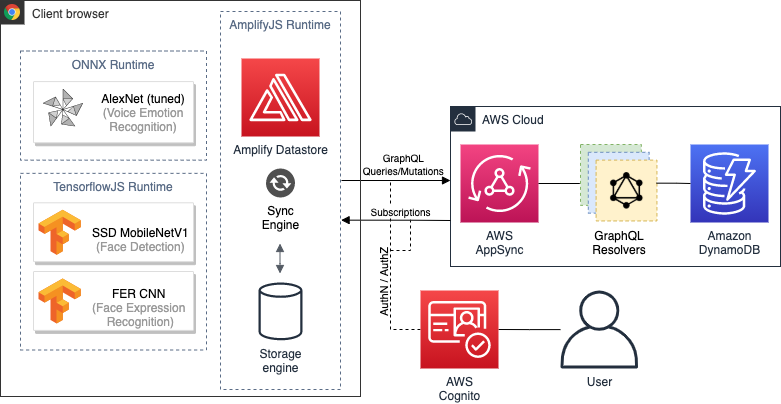
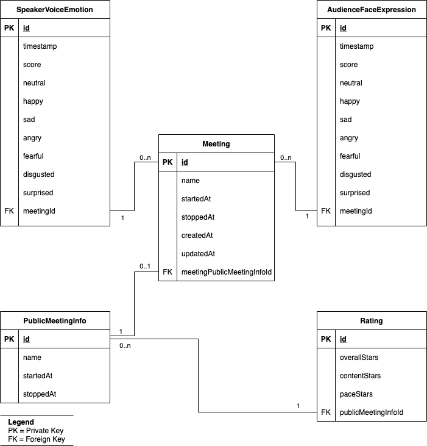

# What is Moody?
Moody is a web application allowing the host of online meetings (e.g. via Zoom, Microsoft Teams or Google Meet) to collect real-time feedback of the participant's emotions.

Moody is able to collect metrics of the following three dimensions:
1. Facial emotions of the participants. The host can capture his/her screen containing the webcam images of the participants. Moody will detect all faces and predict the emotional state.
2. Vocal emotions of the speaker. The host can capture his/her microphone (or any other input device) and Moody will predict the transmitted vocal emotions using speech emotion recognition.
3. Subjective ratings by the participants on a scale of 1 to 5 stars. The host can share a feedback link after the meeting allowing the participants to rate the meeting.

## Usage
You can access the web app at https://moody.digital. After registration you can create a meeting and start tracking emotions.

**We recommend using Google Chrome because at the time of writing (July 2, 2021) not all features are supported in different browsers like Safari or Mozilla Firefox.**

### How to track face emotions?
Once you have created a meeting click the "Start meeting" button. A popup will ask you for permission to access your screen. After clicking "Allow" the browser prompts you to select the window you want Moody to caputure. Select the window of your video conference tool where the webcam faces are located. Now you should see the recognized faces in the "Faces" tab.

**Note for MacOS users: If this is the first time your browser wants to access your screen you need to allow access in the MacOS settings.**

### How to track vocal emotions?
If the meeting is running you can enable and disable the voice emotion tracking at any time during the meeting. Enable the switch next to the "Stop meeting" button to start tracking voice emotions. After a short loading time Moody will track the audio input of your default audio device. You can check if your voice is recognized by clicking the "Voice" tab. There, you should see an animation reacting to your voice and emotional predictions changing every 2.1 seconds.

You can also change the audio input device using the dropdown next to the switch you used to start tracking your voice.

### How to collect ratings?
After you stopped the meeting by clicking the "Stop meeting" button you will see a "Create feedback link" button. Click this button and copy the link shown in the popup. Share this link with your audience and wait until they submitted their ratings.

As a host you can now access the ratings by clicking the "Ratings" tab.

## Privacy
Emotional data is tracked locally in the user's browser. No voice or video is saved. Only the aggregated data is synchronized with the AWS Cloud.

# Technical architecture
## AWS architecture diagram

## Entitiy relationship diagram

# Development

This project was bootstrapped with [Create React App](https://github.com/facebook/create-react-app).

## Available Scripts

In the project directory, you can run:

### `npm start`

Runs the app in the development mode.\
Open [http://localhost:3000](http://localhost:3000) to view it in the browser.

The page will reload if you make edits.\
You will also see any lint errors in the console.

### `npm run build`

Builds the app for production to the `build` folder.\
It correctly bundles React in production mode and optimizes the build for the best performance.

The build is minified and the filenames include the hashes.\
Your app is ready to be deployed!

See the section about [deployment](https://facebook.github.io/create-react-app/docs/deployment) for more information.

### `npm run eject`

**Note: this is a one-way operation. Once you `eject`, you can’t go back!**

If you aren’t satisfied with the build tool and configuration choices, you can `eject` at any time. This command will remove the single build dependency from your project.

Instead, it will copy all the configuration files and the transitive dependencies (webpack, Babel, ESLint, etc) right into your project so you have full control over them. All of the commands except `eject` will still work, but they will point to the copied scripts so you can tweak them. At this point you’re on your own.

You don’t have to ever use `eject`. The curated feature set is suitable for small and middle deployments, and you shouldn’t feel obligated to use this feature. However we understand that this tool wouldn’t be useful if you couldn’t customize it when you are ready for it.

## Learn More

You can learn more in the [Create React App documentation](https://facebook.github.io/create-react-app/docs/getting-started).

To learn React, check out the [React documentation](https://reactjs.org/).
